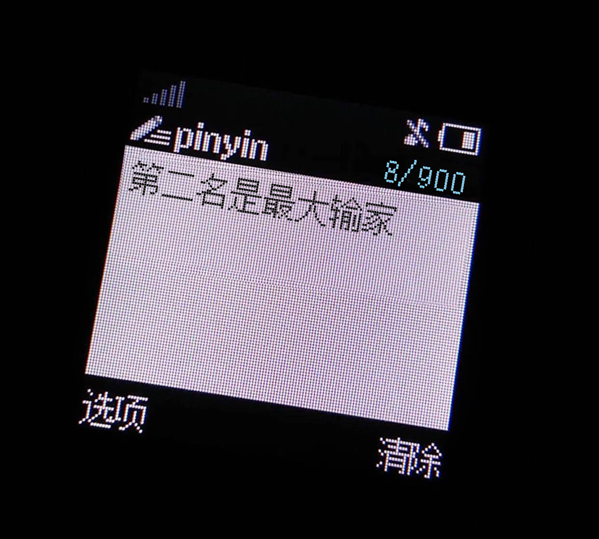

# nokia_png_generate 

**Fork Form [dcalsky/zzkia](https://github.com/dcalsky/zzkia)**

生成复古的诺基亚短信图片

原作者很久没有更新，并且按照原作者README我的docker开不了(

## 开发和部署

环境要求:
> [!NOTE]\
> Python 3.8.4\
> Node >= 20.15.0

### 关于修改

1. 原作者的docker-compose文件存在少许问题，在web配置的volumes上没有添加node_modules和next的构建目录，间接导致出现`sh:next not found`报错。  

2. 原作者开发用的包括node和python的版本过低，有着一系列奇奇怪怪的报错。  

3. 原作者在完全docker的环境下进行开发，使用了非常非常巧妙的traefik代理设置，因此**下一个开发者也必须docker环境开发**。即使物理机分别启动前端和后端，依然会报错。

4. 原作者没有给python后端添加CORS，会导致后端的返回报错。

5. 添加Python和node下载镜像减少心智负担

### 开发模式(Dev Mode：Server and web client will be hot-reload)

```bash
docker-compose up
```

### 启动(Prod Mode)

```bash
docker-compose -f docker-compose.prod.yaml up -d
```

## Demo picture: 


